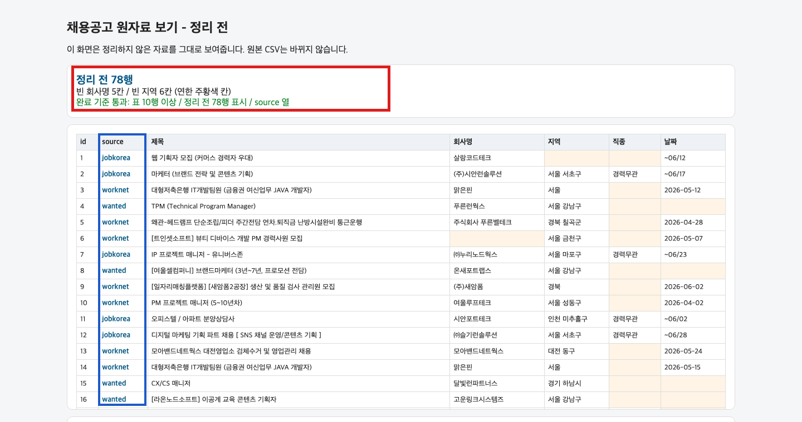

<!-- spec_ref: 02_세션설계/S2_시연_첫실행_설계.md + 04_배포소스_클린룸/day6_학생콘텐츠_2교시_시연과첫실행.md(완료선) -->
# Day6 오전 첫 실행 - 정리 전 자료를 화면에 띄우기

오늘 만드는 것: 정리하지 않은 채용공고 자료를 그대로 보여주는 브라우저 표
오늘 내가 하는 것: 폴더 열기 → Go Live → 표 확인 → 완료 보고
끝나면 남는 것: `정리 전 78행` 표시 + 10행 이상 표 + source 열 + 완료 보고 1줄

> 오늘 오전은 코드를 쓰지 않습니다. 화면을 띄우는 것까지가 목표입니다. 같은 곳에서 5분 막히면 화면 캡처와 단계 번호를 스레드에 올립니다.

## 0. 시작 전 30초 점검

- `0_starter` 안에 `원자료_보기` 폴더가 보인다.
- 그 안에 `index.html`, `app.js`, `data/jobs_dirty_A.csv`가 보인다.
- VS Code 오른쪽 아래에 `Go Live`가 보인다.

하나라도 없으면 파일을 만들지 말고 강사에게 폴더 화면을 보여주세요.

## 1. 화면 열기 (3단계)

1. `원자료_보기` 폴더 전체를 VS Code로 엽니다.
2. `index.html`을 누릅니다.
3. 오른쪽 아래 `Go Live`를 누릅니다.

`index.html`을 파인더에서 더블클릭하면 표가 뜨지 않습니다. 반드시 VS Code의 `Go Live`로 엽니다.

## 2. 화면에서 확인할 것

| 확인 | 통과 기준 |
|---|---|
| 행 수 | 파란 글씨로 `정리 전 78행`이 보임 |
| 표 | 10행 이상 보임 |
| 출처 | 파란색 source 값(wanted / jobkorea / worknet)이 각 행에 보임 |

세 가지가 맞으면 초록색 `완료 기준 통과` 문구와 `완료 영수증 복사` 버튼이 켜집니다.

## 3. 자료를 눈으로 읽기

- 연한 주황색 칸이 **비어 있는 칸**입니다. 빈 회사명 5칸, 빈 지역 6칸이 보입니다.
- 3행과 14행을 비교해 보세요. 회사도 제목도 같은 공고가 두 번 들어와 있습니다.
- 날짜 칸은 `2026-05-12` 같은 형식과 `~06/12` 같은 형식이 섞여 있습니다.

이게 정리되지 않은 자료의 실제 모습입니다. 오후에는 이걸 정리하는 규칙을 직접 고릅니다.

## 4. 완료 보고

1. `완료 영수증 복사`를 누릅니다.
2. 스레드에 붙여넣고 이름과 막힌 곳을 채웁니다.

> [첫 실행] 이름 / 표가 떴다(O/X) / 정리 전 78행 / source 보임(O/X) / 막힌 곳(없으면 없음)

X여도 현재 상태를 그대로 보고합니다.

## 막히면 - 4단 복구

1. 화면 문구를 그대로 읽습니다.
2. 강력 새로고침(Cmd+Shift+R / Ctrl+Shift+R)을 합니다.
3. 폴더를 닫고 0부터 다시 엽니다.
4. 5분이 지났으면 캡처와 단계 번호를 스레드에 올립니다.

## 증상 → 원인 후보 → 다음 행동

| 증상 | 원인 후보 | 다음 행동 |
|---|---|---|
| 표 대신 `자료를 못 불러왔습니다` | 파인더에서 더블클릭으로 열었음 | VS Code에서 `Go Live`로 다시 엽니다 |
| Go Live가 안 보임 | 다른 폴더를 열었거나 확장 미설치 | 오른쪽 아래를 확인하고 캡처를 올립니다 |
| 표가 비어 있음 | `data` 폴더가 같이 안 열림 | 폴더 전체를 다시 엽니다 |
| 한글이 깨져 보임 | 파일을 다른 방식으로 저장함 | `jobs_dirty_A_reset.csv`로 복구합니다 |
